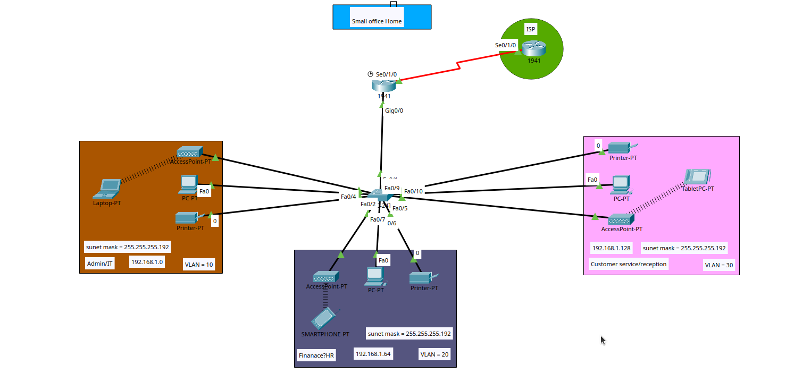

# 🏠 Small Office Home Network Project

> A simulated small office/home network designed with **Cisco Packet Tracer**, implementing VLANs, subnetting, inter-VLAN routing, DHCP, and ISP connectivity via a serial WAN link.

---

## 🗺️ Network Topology



---

## 🏗️ Network Overview

The network serves a **small office/home (SOHO)** environment with 3 departments segmented into separate VLANs. A single **Cisco 1941 router** handles inter-VLAN routing and connects the office to the **ISP** via a serial link (Se0/1/0). A **Layer 2 switch** manages all VLAN access ports and trunk links.

---

## 🏢 Department Layout

| Department              | VLAN | Network Address | Subnet Mask       | Devices                              |
|-------------------------|------|-----------------|-------------------|--------------------------------------|
| Admin / IT              | 10   | 192.168.1.0     | 255.255.255.192   | PC, Laptop, Printer, Access Point    |
| Finance / HR            | 20   | 192.168.1.64    | 255.255.255.192   | PC, Printer, Smartphone, Access Point|
| Customer Service / Reception | 30 | 192.168.1.128 | 255.255.255.192   | PC, Printer, Tablet, Access Point    |

---

## 🔧 Technologies & Concepts Implemented

### 📡 VLANs (Virtual Local Area Networks)
- **3 VLANs** configured across one switch (VLAN 10, 20, 30)
- Each department is isolated in its own VLAN for **security and traffic control**
- **Trunk link** configured between the switch and router to carry all VLANs
- **Access ports** assigned per device to the correct VLAN

---

### 📐 Subnetting
- A single **192.168.1.0 /24** address space is split into **/26 subnets** (255.255.255.192), giving **62 usable hosts** per department:

| Subnet           | Range                       | Department              |
|------------------|-----------------------------|-------------------------|
| 192.168.1.0 /26  | 192.168.1.1 – 192.168.1.62  | Admin / IT (VLAN 10)    |
| 192.168.1.64 /26 | 192.168.1.65 – 192.168.1.126| Finance / HR (VLAN 20)  |
| 192.168.1.128 /26| 192.168.1.129 – 192.168.1.190| Customer Service (VLAN 30)|

---

### 🔄 Inter-VLAN Routing (Router-on-a-Stick)
- Sub-interfaces configured on the router's **Gig0/0** port, one per VLAN:
  - `Gig0/0.10` → VLAN 10 gateway
  - `Gig0/0.20` → VLAN 20 gateway
  - `Gig0/0.30` → VLAN 30 gateway
- Allows devices across different VLANs to communicate through the router

---

### 📦 DHCP (Dynamic Host Configuration Protocol)
- DHCP pools configured on the **1941 router**, one per VLAN
- Each pool assigns:
  - IP address from the correct subnet
  - Subnet mask (255.255.255.192)
  - Default gateway (sub-interface IP)
  - DNS server
- All end devices receive IPs **automatically**

---

### 🌍 ISP Connectivity (WAN)
- The office router connects to the **ISP router** via a **serial link** (Se0/1/0)
- Simulates real-world internet access from the office network
- Static or default route configured to forward internet-bound traffic to the ISP

---

### 📶 Wireless (Access Points)
- **Access Points** deployed in all 3 departments
- Wireless clients (Laptops, Smartphones, Tablets) connect to the correct VLAN
- Simulates real office Wi-Fi coverage per department zone

---

## 🖥️ Devices Used

| Device           | Model / Type        | Role                                  |
|------------------|---------------------|---------------------------------------|
| Router           | Cisco 1941 (office) | Inter-VLAN routing, DHCP, WAN gateway |
| ISP Router       | Cisco 1941 (ISP)    | Simulated ISP endpoint                |
| Switch           | Cisco 2960          | VLAN switching, trunk to router       |
| PCs              | End devices         | Department workstations               |
| Laptops          | End devices         | Wireless clients                      |
| Printers         | Network printers    | Shared per department                 |
| Smartphones      | Wireless clients    | Mobile access                         |
| Tablets          | Wireless clients    | Mobile access                         |
| Access Points    | Wireless AP         | Wi-Fi per department                  |

---

## 📐 IP Addressing Summary

| Department              | VLAN | Network           | Gateway         | Subnet Mask       |
|-------------------------|------|-------------------|-----------------|-------------------|
| Admin / IT              | 10   | 192.168.1.0 /26   | 192.168.1.1     | 255.255.255.192   |
| Finance / HR            | 20   | 192.168.1.64 /26  | 192.168.1.65    | 255.255.255.192   |
| Customer Service        | 30   | 192.168.1.128 /26 | 192.168.1.129   | 255.255.255.192   |

---

## 🚀 How to Open

1. Install [Cisco Packet Tracer](https://www.netacad.com/courses/packet-tracer) (version 8.0+)
2. Clone this repository:
   ```bash
   git clone https://github.com/thisishisham1/Small-Office-Home-Network.git
   ```
3. Open `simple_office_home.pkt` in Cisco Packet Tracer
4. Explore the topology and test connectivity using **ping** between departments

---

## ✅ Testing Connectivity

Verify the network works by:
- Pinging between VLANs (inter-VLAN routing test)
- Checking DHCP — devices should auto-receive IPs
- Pinging the ISP router (WAN connectivity test)
- Connecting smartphones/laptops wirelessly and verifying correct subnet assignment

---

## 👤 Author

**Hisham** — Computer Science Graduate | Network Engineering Enthusiast

[](https://github.com/thisishisham1)
[](https://www.linkedin.com/in/hishamohamedswe/)

---

## 🛠️ Tools Used


